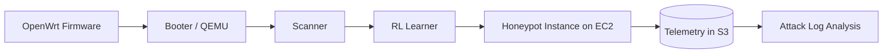
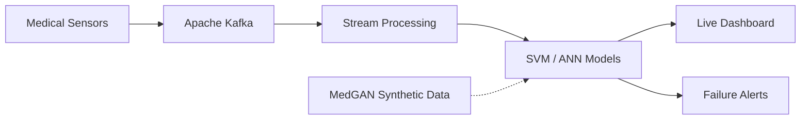

<!-- ============================ HEADER ============================ -->
<div align="center">


<a href="https://git.io/typing-svg">
  
</a>

<br/>

<a href="https://www.linkedin.com/in/chetan-donawadi"></a>
<a href="mailto:chetandonawadi@gmail.com"></a>


</div>

<br/>

<!-- ============================ TERMINAL ============================ -->
```bash
chetan@dev:~$ whoami
Chetan Donawadi — Backend Engineer

chetan@dev:~$ cat profile.json
{
  "education"     : "B.Tech Computer Science, PES University (2026)",
  "certification" : "AWS Certified Cloud Practitioner (CLF-C02)",
  "focus"         : ["Backend Systems", "Streaming Pipelines", "Cloud", "IoT Security"],
  "languages"     : ["Python", "Java", "SQL"],
  "status"        : "Open to full-time backend roles"
}

chetan@dev:~$ _
```

<br/>

<!-- ============================ IMPACT ============================ -->
<div align="center">


</div>

<br/>

## Tech Stack

<table>
<tr>
<td width="25%" align="center"><b>Languages</b></td>
<td>

</td>
</tr>
<tr>
<td align="center"><b>Backend</b></td>
<td>

</td>
</tr>
<tr>
<td align="center"><b>Data & Streaming</b></td>
<td>

</td>
</tr>
<tr>
<td align="center"><b>Cloud & DevOps</b></td>
<td>

</td>
</tr>
<tr>
<td align="center"><b>ML & Robotics</b></td>
<td>


</td>
</tr>
<tr>
<td align="center"><b>Core CS</b></td>
<td>
<code>Data Structures & Algorithms</code> · <code>OOP</code> · <code>DBMS</code> · <code>Design Patterns</code> · <code>REST API Design</code>
</td>
</tr>
</table>

<br/>

## Selected Work

### FirmPot — Intelligent IoT Honeypot
`Python` `QEMU` `Reinforcement Learning` `AWS EC2` `S3` &nbsp;·&nbsp; *Research Project, Jan – May 2026*

Emulates OpenWrt firmware images with QEMU to create realistic embedded-device environments for threat observation. A modular pipeline (booter, scanner, learner) boots firmware, scans web interfaces, and learns interaction patterns. Reinforcement learning models attacker behavior to increase honeypot engagement and the quality of captured telemetry. Instances run on AWS EC2, with logs stored in S3 for vulnerability analysis.



<br/>

### Predictive Maintenance of Medical Equipment
`Python` `Kafka` `TensorFlow` `AWS` &nbsp;·&nbsp; *December 2025*

A real-time system that predicts equipment failures, failure types, and severity from streaming sensor data, reaching **90.67% accuracy** with SVM and ANN models. MedGAN generates realistic synthetic data to overcome limited real-world datasets. A live dashboard provides monitoring, anomaly detection, and automated failure alerts.



<br/>

### Budget & Expense Tracker
`Java` `Spring Boot` `MySQL` `Spring Data JPA` &nbsp;·&nbsp; *September 2025*

A full-stack Spring Boot MVC application for expense tracking, budget planning, goal management, alerts, charts, and CSV export. Designed with OOAD principles and the **Strategy, Observer, Singleton, and DAO** patterns, with normalized MySQL persistence and unit-tested core services.

<br/>

### Hector SLAM Mapping & Indoor Positioning Robot
`ROS` `LiDAR` `Gazebo` `RViz` &nbsp;·&nbsp; *April 2025*

An autonomous indoor robot that builds accurate 2D occupancy grid maps in real time using only LiDAR, with no GPS, wheel odometry, or IMU. Scan-matching localization estimates robot pose in unknown environments, with ROS and RViz visualization and support for saving and reusing maps.

<br/>

## Achievements

| | |
|---|---|
| **AWS Certified Cloud Practitioner** | CLF-C02, May 2026 |
| **PESU Arithamania Hackathon** | Ranked Top 10 out of 52 teams |
| **Diploma in Mechatronics** | 9.3 / 10 GPA, Top 5% of batch |
| **AWS Cloud & Big Data** | Hands-on training |
| **Table Tennis** | State-level player |

<br/>

## GitHub Analytics

<div align="center">


<br/>


<br/><br/>


<br/>

<picture>
  <source media="(prefers-color-scheme: dark)" srcset="https://raw.githubusercontent.com/chetandonawadi123/chetandonawadi123/output/github-snake-dark.svg" />
  <source media="(prefers-color-scheme: light)" srcset="https://raw.githubusercontent.com/chetandonawadi123/chetandonawadi123/output/github-snake.svg" />
  
</picture>

</div>

<br/>

## Currently

- Building backend and cloud projects with a focus on clean architecture and reliability
- Going deeper into distributed systems and event-driven design
- Looking for a **full-time backend engineering role**

<br/>

<div align="center">

**Let's connect**

<a href="https://www.linkedin.com/in/chetan-donawadi"></a>
<a href="mailto:chetandonawadi@gmail.com"></a>

</div>


